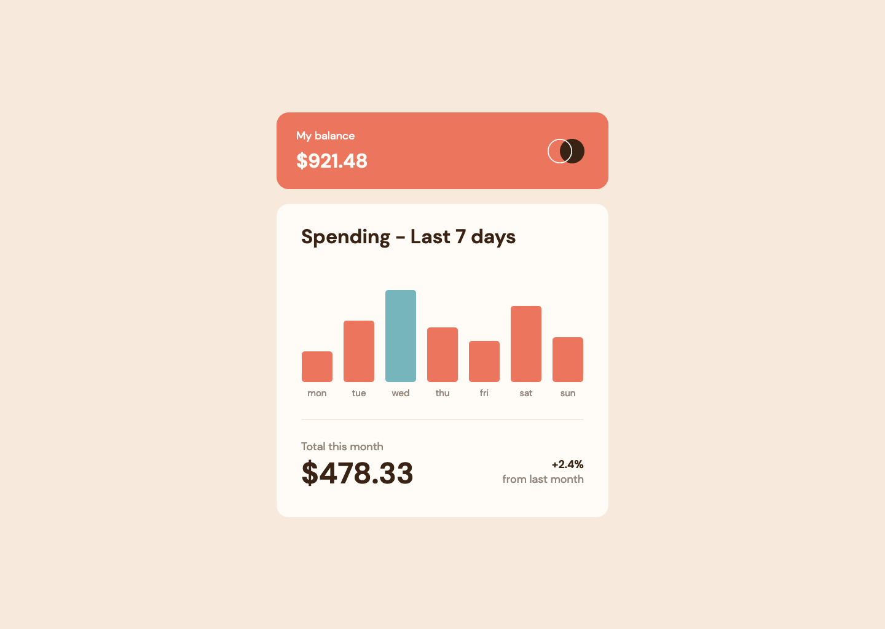

# Expenses chart component solution

This is a solution to the [Expenses chart component challenge on Frontend Mentor](https://www.frontendmentor.io/challenges/expenses-chart-component-e7yJBUdjwt).

| **Links** | [Solution URL](https://github.com/ionStici/expenses-chart-component-fem) | [Live Site URL](https://ionstici.github.io/expenses-chart-component-fem) |
| --------- | ------------------------------------------------------------------------ | ------------------------------------------------------------------------ |

| **Author** | [GitHub](https://github.com/ionStici) | [Frontend Mentor](https://www.frontendmentor.io/profile/ionStici) | [Twitter](https://twitter.com/ionStici_) |
| ---------- | ------------------------------------- | ----------------------------------------------------------------- | ---------------------------------------- |

 

<!-- ### Primary

- Soft red: hsl(10, 79%, 65%)
- Cyan: hsl(186, 34%, 60%)

### Neutral

- Dark brown: hsl(25, 47%, 15%)
- Medium brown: hsl(28, 10%, 53%)
- Cream: hsl(27, 66%, 92%)
- Very pale orange: hsl(33, 100%, 98%)

### Body Copy

- Font size: 18px

### Font

- Family: [DM Sans](https://fonts.google.com/specimen/DM+Sans)
- Weights: 400, 700 -->
